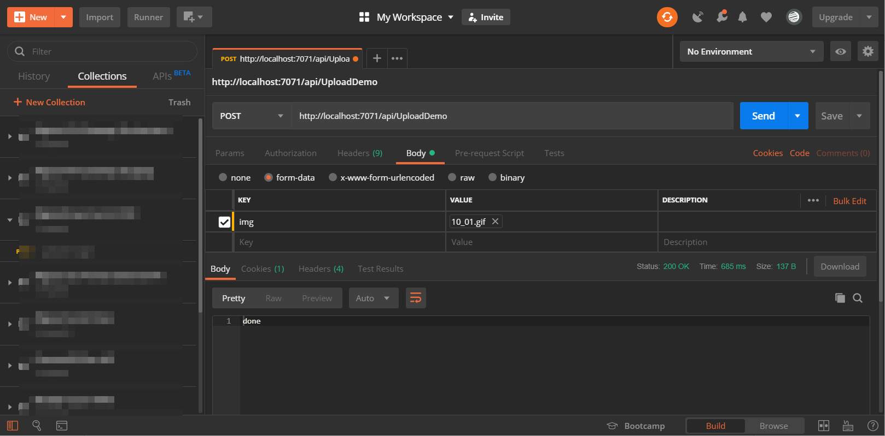
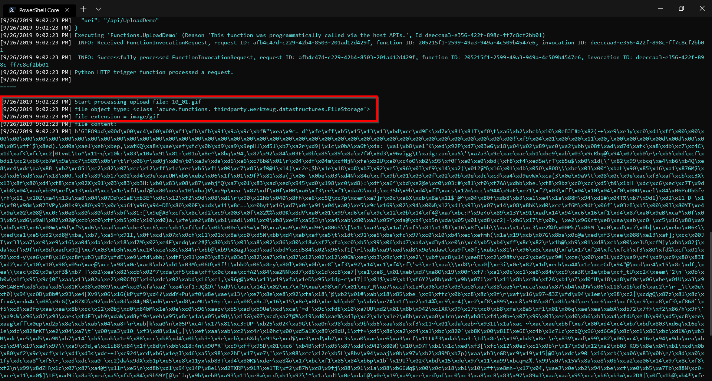
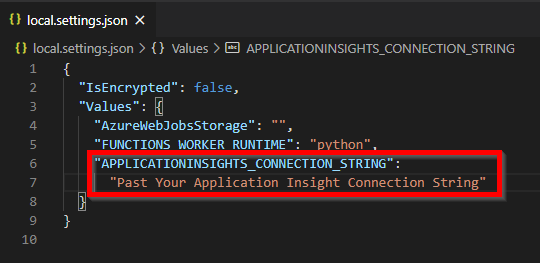

# PythonAzureFunctionDemo

Demo using python in Azure function to process upload file, you need to install [azure-function](https://pypi.org/project/azure-functions/) python package.

On client side using POSTMan to upload an img:

And you will see upload image file(s) being read and print to logging console:

The special `FileStorage` type's source code is in a deep location: https://github.com/Azure/azure-functions-python-library/blob/edce123f18b2b45d0d18c0bccd6e934290af0dee/azure/functions/_thirdparty/werkzeug/datastructures.py#L2693

Be sure to add additional Azure Application Insight Setting in `local.settings.json` when running on local develop environment:
